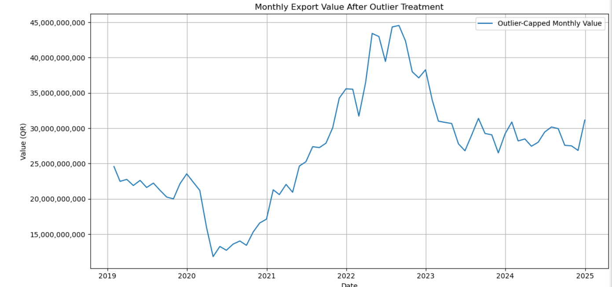
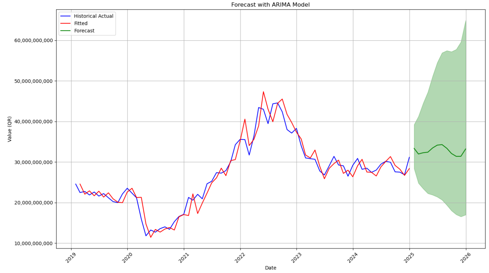
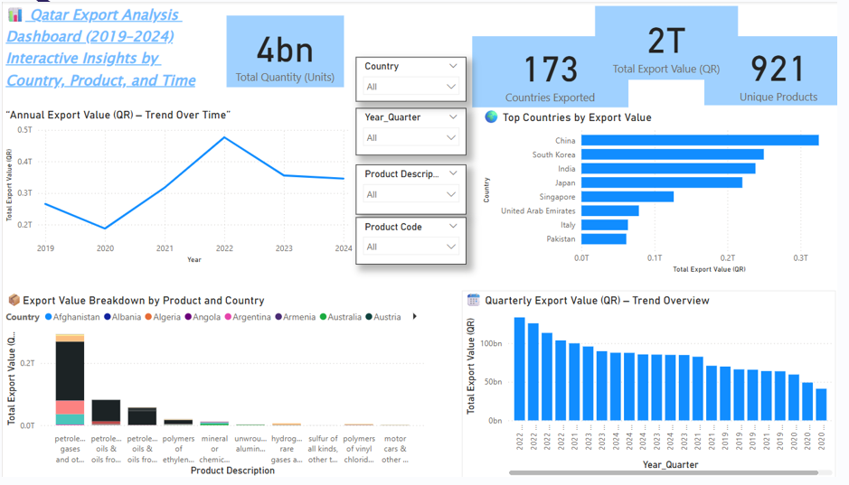

# 📊 Qatar Export Data Analysis & Forecasting (2019–2024)

This project analyzes **Qatar’s export statistics (2019–2024)** and applies **time series forecasting (SARIMA)** to predict future export values.  
It combines **Python-based analysis** and an **interactive Power BI dashboard** to provide insights into export trends, key trade partners, and product categories.

---

## 📌 Project Objectives
- Perform exploratory data analysis (EDA) on Qatar’s export dataset  
- Identify trends, seasonality, and patterns in export values  
- Build and evaluate **SARIMA models** for forecasting  
- Design an interactive **Power BI dashboard** for visualization  
- Provide insights for policymakers, economists, and businesses  

---

## 📊 Dataset
- **Source**: [Qatar Open Data Portal](https://www.data.gov.qa/)  
- **Years Covered**: 2019 Q1 – 2024 Q4  
- **Records**: ~1000+ rows  
- **Key Columns**:  
  - `Year` | `Quarter` | `Country` | `HS Code` | `Quantity` | `Weight` | `Export Value (QAR)`

Example:

| Year | Quarter | Country | HS Code | Quantity | Weight | Export Value (QAR) |
|------|---------|---------|---------|----------|--------|--------------------|
| 2020 | Q2      | Japan   | 2709    | 5000     | 20000  | 3,200,000          |

---

## 🔬 Methodology
### 1. Data Preprocessing
- Cleaned missing/duplicate values  
- Aggregated exports by **quarter**  
- Converted to **time series format**  
- Seasonal Decomposition (trend + seasonality + residuals)  

---

### 2. Time Series Forecasting
- Built **SARIMA (Seasonal ARIMA)** models  
- Model selection using ACF/PACF & GridSearch  
- Train-Test split (80/20) for evaluation  

---

### 3. Model Evaluation
- **AIC**: -141.346  
- **BIC**: -134.558  
- **HQIC**: -138.646  
- Ljung-Box (Q) Test p=0.93 → residuals are independent  
- Jarque-Bera Test p=0.01 → residuals not perfectly normal  
- Model coefficients (significant): ma.L1 = 0.210, ma.S.L12 = 0.597  

---

## 📈 Results
- **SARIMA** captured quarterly seasonality and long-term growth trends  
- Forecast showed **stable export growth with fluctuations** in upcoming quarters  

✅ Suitable for forecasting trade performance and supporting **economic planning**.

---

## 📊 Power BI Dashboard
An interactive dashboard was developed with filters & KPIs:
- Export trends by **Year & Quarter**  
- Top export **countries**  
- Product categories (**HS Codes**)  
- **Forecasting visualizations**  

---

